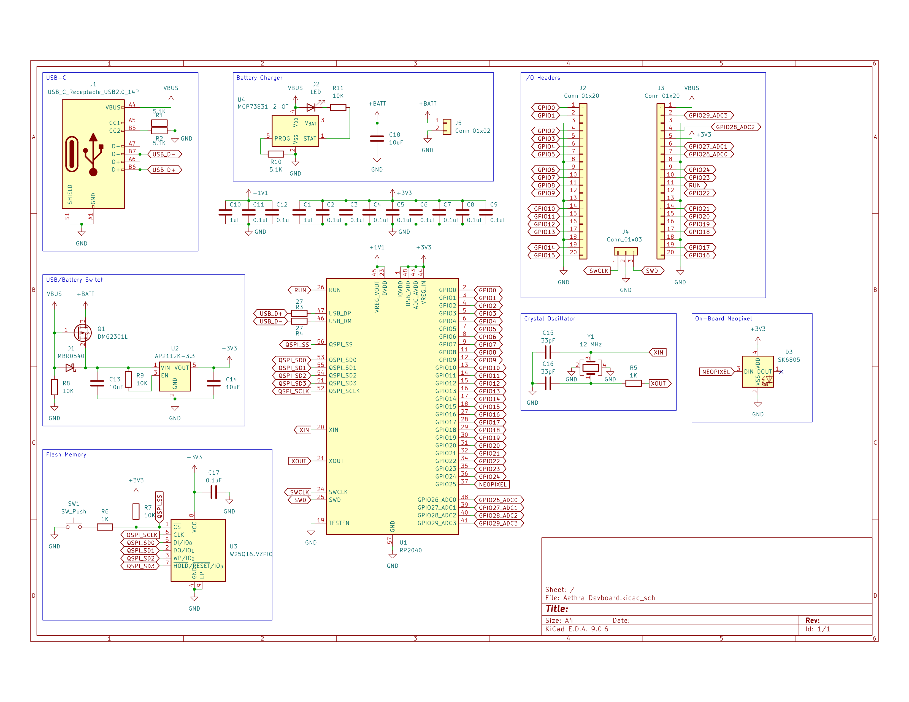
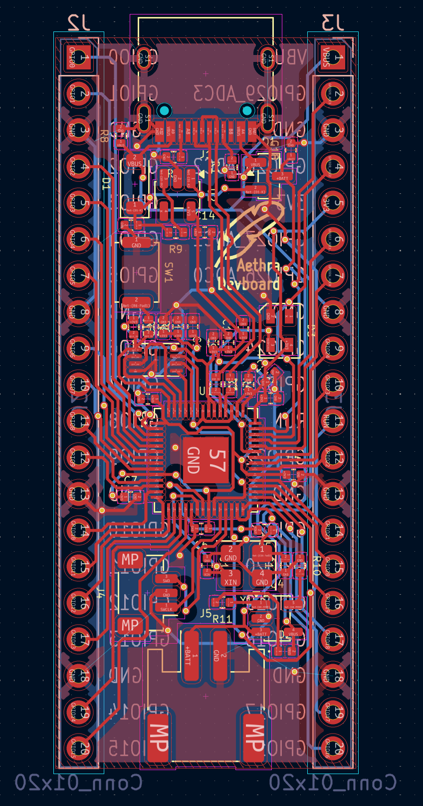

# aethra-devboard
Custom devboard based on the RP2040 chip. Includes LiPo 3.7V battery charger and
power source selector, onboard neopixel LED, 16MB flash storage and 29 GPIO
pins.

## Schematic

## PCB

## BOM
|Comment                    |Footprint                                       |LCSC Part No|Quantity|Link                                                 |Price/unit |Total  |
|---------------------------|------------------------------------------------|------------|--------|-----------------------------------------------------|-----------|-------|
|AP2112K-3.3                |SOT-23-5                                        |C23380830   |1       |https://www.lcsc.com/product-detail/C23380830.html   |0.0975     |0.0975 |
|RP2040                     |QFN-56-1EP_7x7mm_P0.4mm_EP3.2x3.2mm             |C2040       |1       |https://www.lcsc.com/product-detail/C2040.html       |0.9577     |0.9577 |
|33pF                       |C_0402_1005Metric                               |C1562       |2       |https://www.lcsc.com/product-detail/C1562.html       |0.0011     |0.0022 |
|0.1uF                      |C_0402_1005Metric                               |C1525       |11      |https://www.lcsc.com/product-detail/C1525.html       |0.0013     |0.0143 |
|10K                        |R_0402_1005Metric                               |C25744      |4       |https://www.lcsc.com/product-detail/C25744.html      |0.0007     |0.0028 |
|1uF                        |C_0402_1005Metric                               |C52923      |2       |https://www.lcsc.com/product-detail/C52923.html      |0.0032     |0.0064 |
|1K                         |R_0402_1005Metric                               |C11702      |2       |https://www.lcsc.com/product-detail/C11702.html      |0.0006     |0.0012 |
|Conn_01x02                 |JST_PH_S2B-PH-SM4-TB_1x02-1MP_P2.00mm_Horizontal|C295747     |1       |https://www.lcsc.com/product-detail/C295747.html     |0.1877     |0.1877 |
|27                         |R_0402_1005Metric                               |C138021     |2       |https://www.lcsc.com/product-detail/C138021.html     |0.0008     |0.0016 |
|12 MHz                     |Crystal_SMD_3225-4Pin_3.2x2.5mm                 |C9002       |1       |https://www.lcsc.com/product-detail/C9002.html       |0.0681     |0.0681 |
|W25Q16JVZPIQ               |Winbond_USON-8-1EP_3x2mm_P0.5mm_EP0.2x1.6mm     |C377853     |1       |https://www.lcsc.com/product-detail/C377853.html     |1.0674     |1.0674 |
|USB_C_Receptacle_USB2.0_14P|USB_C_Receptacle_HRO_TYPE-C-31-M-12             |C165948     |1       |https://www.lcsc.com/product-detail/C165948.html     |0.1772     |0.1772 |
|LED                        |LED_0402_1005Metric                             |C130719     |1       |https://www.lcsc.com/product-detail/C130719.html     |0.0369     |0.0369 |
|10uF                       |C_0402_1005Metric                               |C15525      |3       |https://www.lcsc.com/product-detail/C15525.html      |0.005      |0.015  |
|Conn_01x03                 |JST_SH_BM03B-SRSS-TB_1x03-1MP_P1.00mm_Vertical  |C160389     |1       |https://www.lcsc.com/product-detail/C160389.html     |0.2576     |0.2576 |
|DMG2301L                   |SOT-23                                          |C102619     |1       |https://www.lcsc.com/product-detail/C102619.html     |0.07       |0.07   |
|5.1K                       |R_0402_1005Metric                               |C25905      |3       |https://www.lcsc.com/product-detail/C25905.html      |0.0006     |0.0018 |
|MCP73831-2-OT              |SOT-23-5                                        |C424093     |1       |https://www.lcsc.com/product-detail/C424093.html     |0.7226     |0.7226 |
|MBR0540                    |D_SOD-123                                       |C116159     |1       |https://www.lcsc.com/product-detail/C116159.html     |0.0204     |0.0204 |
|SW_Push                    |SW_Push_SPST_NO_Alps_SKRK                       |C720477     |1       |https://www.lcsc.com/product-detail/C720477.html     |0.0444     |0.0444 |
|Conn_01x20                 |PinHeader_1x20_P2.54mm_Vertical                 |            |2       |https://www.aliexpress.com/item/4001053521664.html   |1.255      |2.51   |
|SK6805                     |LED_SK6805_PLCC4_2.4x2.7mm_P1.3mm               |            |1       |https://www.aliexpress.com/item/1005008979678361.html|5.53       |5.53   |
|LiPo                       |LiPoly 3.7V 2000mAh PH2.0                       |            |1       |https://www.aliexpress.com/item/1005009590723370.html|1.53       |1.53   |
|                           |                                                |            |        |                                                     |Grand Total|13.3228|
